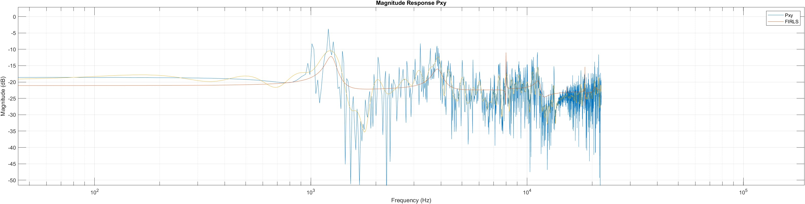

# cloning_equalizer 

What is this ? 

This a MATLAB script that given a source audio file computes a filter that matches the frequency spectrum of another target audio file.

This is also called *cloning equalizer* or *matching equalizer*. 

Requires Signal Processing Toolbox.

For what do I need this ? 

  - If you play guitar using software modeling amps, trying to achieve a particular sound by manually adjusting an equalizer can be quite difficult 
  - Luckily, most guitar amplifier software has a way to create a custom filters by using an *impulse response* 
  - This script computes the this impulse response 

## Advantages

  - Works with every guitar amplifier software that supports impulse responses
  - Does not require a ton of training data, a couple of seconds are enough

## How to use 

First, try to get as close as possible to the target sound manually.

Then, record how your amp sounds currently (source file) and how it should sound like (target file), five seconds are enough. 

Change at the beginning of the `cloning_equalizer.m` script the `source_audio_filename` and `target_audio_filename` variables. Both files should be mono files in WAVE format. 

Then start the script in MATLAB. 

The filter gets computed and the impulse response is written to `impulse_response.wav`. 

The source with the filter applied is also saved to `source_filtered_firls.wav`, you can have a listen how it sounds like.

## Limitations 

Impulse responses describe linear, deterministic filters, they cannot describe noise generators. This means if you need a noisy target sound you would have to tune your amp approximately correct.

In other words, amplifier modeling is difficult and you cannot create a completely different sound with using only an impulse response, the source audio file must be somewhat close to the target audio.

## Other related Software 

You may be also interested in neural network based amplifier modeling tools like: 

  - [neural-amp-modeler](https://github.com/sdatkinson/neural-amp-modeler)
  - [SmartGuitarAmp](https://github.com/GuitarML/SmartGuitarAmp)

## License 

This code is licensed under MIT.

